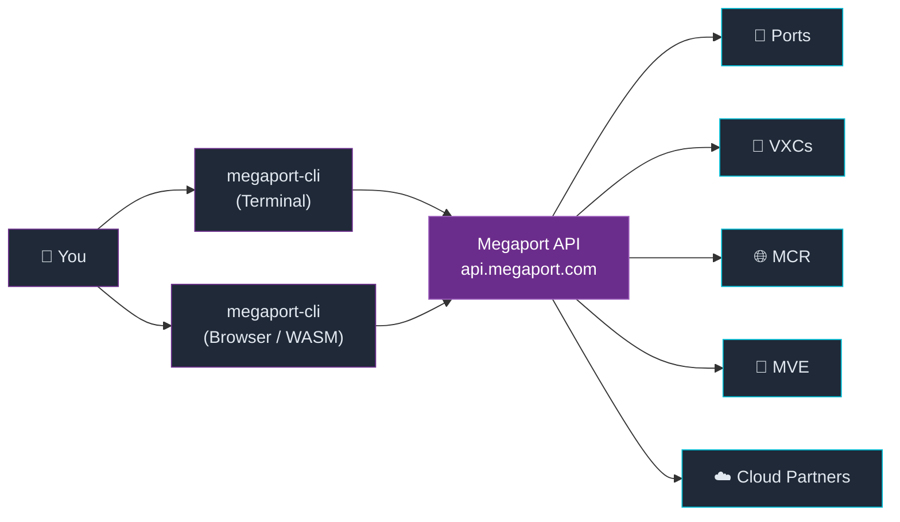

# Introduction to the Megaport CLI

The Megaport CLI is a command-line tool that gives you complete programmatic control over Megaport's Software Defined Networking platform. Manage ports, virtual cross connects, cloud routers, and more — from your terminal, in scripts, or live in your browser.

## What can you do with it?

- **Provision infrastructure** — create and manage Ports, VXCs, MCRs, MVEs, and Internet Exchange connections
- **Connect to any cloud** — AWS Direct Connect, Azure ExpressRoute, Google Cloud Interconnect, and more
- **Automate operations** — scripting-friendly JSON output and input, ideal for CI/CD pipelines
- **Explore the network** — browse 700+ locations across 23 countries, list partner configurations
- **Run it anywhere** — native binary, Docker, or live in the browser via WebAssembly

## Resource types

The CLI covers the full Megaport platform across 14 resource types:

| Resource | What it is |
|---|---|
| **Port** | A physical connection into the Megaport fabric at a data centre |
| **VXC** | A Virtual Cross Connect — a layer 2 connection between two endpoints |
| **MCR** | Megaport Cloud Router — layer 3 routing between clouds and sites |
| **MVE** | Managed Virtual Edge — SD-WAN virtual network functions in the Megaport fabric |
| **IX** | Internet Exchange — access to public internet peering |
| **Location** | A data centre on the Megaport fabric where you can deploy resources |
| **Partner** | A cloud provider or network partner with a presence on Megaport |
| **Service Key** | A one-time-use key for provisioning a VXC via a partner |
| **User** | Megaport account user management |

## Choose your path

::info-card{type="tip" title="For Sales & Pre-Sales"}
Want to jump straight into a live demo? The CLI runs entirely in your browser — no install, no credentials setup needed for browsing.

**[→ Skip to Live Demos](/demos/browser-terminal)**
::

::info-card{type="note" title="For Solutions Architects"}
If you're comfortable with CLIs, skip ahead to [First Commands](/getting-started/first-commands) after installing. Or follow the full guide for authentication and profile setup.

**[→ Jump to First Commands](/getting-started/first-commands)**
::

## Architecture

The `megaport-cli` binary (or its WebAssembly build) talks directly to the Megaport API. No middleware, no server — just your credentials and the API.

## What you'll learn in Getting Started

1. **[Installation](/getting-started/installation)** — native binary, Docker, and the browser WASM build
2. **[Authentication](/getting-started/authentication)** — env vars, config profiles, and credential precedence
3. **[First Commands](/getting-started/first-commands)** — list locations, explore resources, understand output formats
