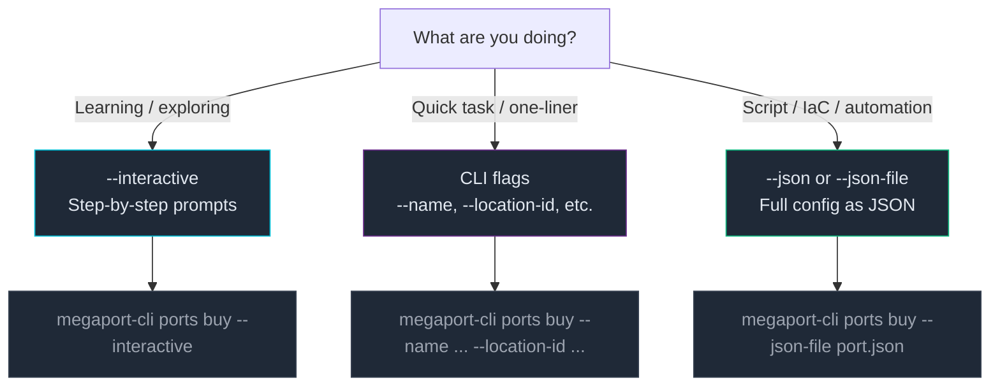

# Input Modes

Every `buy` and `update` command accepts configuration in three different ways. Same command, same result — you choose the interface that fits your context.



---

## Interactive mode

The `--interactive` flag (short: `-i`) launches a guided prompt session. The CLI walks you through each parameter one at a time, validates your input immediately, and shows available options where applicable.

**Best for:**
- Learning what parameters a command requires
- Exploring options you're not sure about
- One-off tasks where you don't want to look up flag names

```bash
megaport-cli ports buy --interactive
```

A session looks like this:

```
? Port name: Sydney Primary
? Location ID (run 'locations list' to find IDs): 3
? Port speed [1000, 10000, 100000]: 10000
? Contract term in months [1, 12, 24, 36]: 12
? Market code (e.g. AU, US, EU): AU
? Enable Link Aggregation Group (LAG)? No

Summary:
  Name:        Sydney Primary
  Location:    3
  Speed:       10000 Mbps (10G)
  Term:        12 months
  Market:      AU

? Confirm purchase? Yes

Port created: abc-1234-5678-def
```

::info-card{type="warning" title="Not available in browser WASM"}
Interactive mode requires a TTY. It is not supported in the browser WebAssembly build. Use flags or JSON mode in the browser terminal.
::

---

## CLI flags mode

The default mode — pass all parameters directly as flags on the command line. This is what you use in scripts, CI/CD pipelines, and anywhere you want a single reproducible command.

**Best for:**
- Shell scripts and CI/CD pipelines
- Quick commands where you know the parameters
- Commands you want to store in documentation or runbooks

```bash
megaport-cli ports buy \
  --name "Sydney Primary" \
  --location-id 3 \
  --port-speed 10000 \
  --term 12 \
  --market-code AU
```

### Required vs optional flags

Use `--help` to see which flags are required for any command:

```bash
megaport-cli ports buy --help
```

For `ports buy`, required flags are:
- `--name` — Port name
- `--location-id` — Location ID (integer, from `locations list`)
- `--port-speed` — Speed in Mbps: `1000`, `10000`, or `100000`
- `--term` — Contract term: `1`, `12`, `24`, or `36` months
- `--market-code` — Market code (`AU`, `US`, `EU`, etc.)

Optional flags:
- `--lag` — Create as a Link Aggregation Group
- `--lag-count` — Number of LAG members (only required when `--lag` is set)

::info-card{type="tip" title="Conditional requirements"}
Some flags only become required in specific combinations — for example, `--lag-count` is only required when `--lag` is set. The `--help` output documents these relationships.
::

---

## JSON mode

Pass the full resource configuration as a JSON string (`--json`) or JSON file (`--json-file`). The JSON schema matches the Megaport API request body for that resource type.

**Best for:**
- Infrastructure as Code workflows
- Version-controlled configuration files
- Bulk operations and templating
- Generating configs programmatically

### Inline JSON

```bash
megaport-cli ports buy --json '{
  "name": "Sydney Primary",
  "locationId": 3,
  "portSpeed": 10000,
  "term": 12,
  "marketCode": "AU"
}'
```

### JSON file

```bash
megaport-cli ports buy --json-file ./port-config.json
```

Example `port-config.json`:

```json
{
  "name": "Sydney Primary",
  "locationId": 3,
  "portSpeed": 10000,
  "term": 12,
  "marketCode": "AU",
  "lag": false
}
```

### VXC JSON example

JSON mode shines for complex resources like VXCs with partner configuration:

```bash
megaport-cli vxc buy --json-file ./aws-vxc.json
```

```json
{
  "name": "AWS Direct Connect - Sydney",
  "rateLimit": 1000,
  "aEndUid": "abc-1234-5678-def",
  "aEndVlan": 100,
  "bEndPartnerConfig": {
    "connectType": "AWS",
    "ownerAccount": "123456789012",
    "type": "private",
    "asn": 65000,
    "amazonAsn": 64512,
    "authKey": "your-bgp-auth-key"
  }
}
```

::info-card{type="tip" title="Discover the JSON schema"}
Run any buy command with `--help` to see the JSON field names and types. The CLI validates your JSON before sending it to the API.
::

---

## Side-by-side comparison

The same port purchase in all three modes:

| | Interactive | Flags | JSON |
|---|---|---|---|
| **Command** | `ports buy --interactive` | `ports buy --name ... --location-id 3 ...` | `ports buy --json-file port.json` |
| **Input** | Prompted at runtime | All flags inline | File or string |
| **Best for** | Learning, one-off tasks | Scripts, quick tasks | IaC, automation |
| **Reproducible?** | No | Yes (save the command) | Yes (commit the file) |
| **Browser WASM?** | No | Yes | Yes |

---

## What's next?

- **[Output Formats](/core-concepts/output-formats)** — control what the CLI returns and how
- **[Port Lifecycle tutorial](/tutorials/port-lifecycle)** — practice all three input modes hands-on
