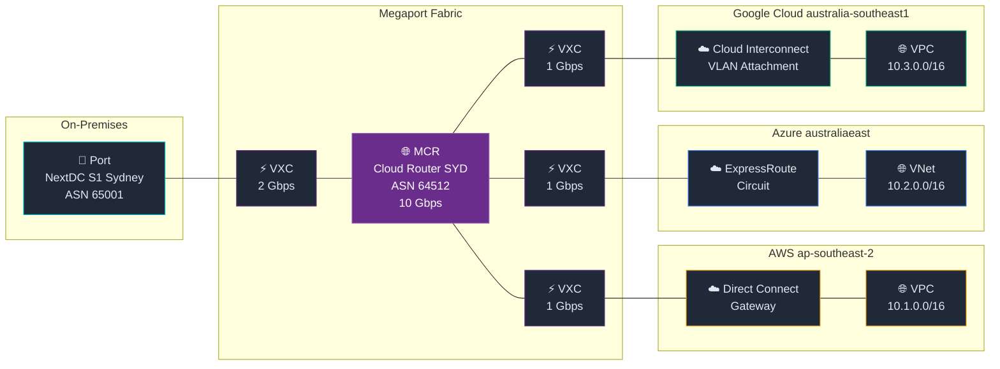

# Multi-Cloud Connectivity

This tutorial builds a complete multi-cloud network: AWS, Azure, and Google Cloud interconnected through a Megaport Cloud Router. Traffic between clouds stays on the private Megaport fabric — no cloud egress fees, no public internet exposure.

## Scenario

A company runs:
- **AWS** — primary compute workloads (ap-southeast-2)
- **Azure** — AI/ML workloads (australiaeast)
- **Google Cloud** — data analytics (australia-southeast1)

All three need to communicate over private connectivity. An on-premises data centre in Sydney also needs access to all clouds.

## Full architecture



## What you'll build

1. MCR as the transit hub
2. VXC from MCR → AWS Direct Connect
3. VXC from MCR → Azure ExpressRoute
4. VXC from MCR → Google Cloud Interconnect
5. Prefix filter lists for per-cloud route control

---

## Step 1 — Provision the MCR

Use a JSON file so the config is version-controlled and reproducible.

`mcr-config.json`:

```json
{
  "name": "Cloud Router SYD",
  "locationId": 3,
  "portSpeed": 10000,
  "term": 12,
  "marketPlaceVisibility": false,
  "mcrAsn": 64512
}
```

```bash
megaport-cli mcr buy --json-file ./mcr-config.json --output json
```

Extract the UID for use in subsequent steps:

```bash
MCR_UID=$(megaport-cli mcr buy --json-file ./mcr-config.json --output json | jq -r '.uid')
echo "MCR: $MCR_UID"
```

---

## Step 2 — Connect to AWS

::info-card{type="note" title="Prerequisite"}
See the [Connect to AWS](/tutorials/connect-aws) tutorial for full AWS-side setup (Direct Connect gateway, virtual interface, etc.).
::

`aws-vxc.json` (replace `aEndUid` with your MCR UID):

```json
{
  "name": "MCR → AWS Direct Connect",
  "rateLimit": 1000,
  "term": 12,
  "aEndUid": "<MCR-UID>",
  "aEndVlan": 100,
  "bEndPartnerConfig": {
    "connectType": "AWS",
    "ownerAccount": "123456789012",
    "type": "private",
    "connectionName": "megaport-syd-prod",
    "asn": 65000
  }
}
```

```bash
AWS_VXC=$(megaport-cli vxc buy --json-file ./aws-vxc.json --output json | jq -r '.uid')
echo "AWS VXC: $AWS_VXC"
```

---

## Step 3 — Connect to Azure

::info-card{type="note" title="Prerequisite"}
Create your Azure ExpressRoute circuit first to get the service key. See [Connect to Azure](/tutorials/connect-azure).
::

`azure-vxc.json`:

```json
{
  "name": "MCR → Azure ExpressRoute",
  "rateLimit": 1000,
  "term": 12,
  "aEndUid": "<MCR-UID>",
  "aEndVlan": 200,
  "bEndPartnerConfig": {
    "connectType": "AZURE",
    "serviceKey": "xxxxxxxx-xxxx-xxxx-xxxx-xxxxxxxxxxxx"
  }
}
```

```bash
AZ_VXC=$(megaport-cli vxc buy --json-file ./azure-vxc.json --output json | jq -r '.uid')
echo "Azure VXC: $AZ_VXC"
```

---

## Step 4 — Connect to Google Cloud

::info-card{type="note" title="Get your GCP pairing key"}
In the GCP Console, go to **Hybrid Connectivity → Interconnect → VLAN Attachments → Create**. Choose **Partner** attachment type and copy the **Pairing Key** before continuing here.
::

First, find Google's partner ports at your location:

```bash
megaport-cli partners list --company-name "Google" --location-id 3
```

`gcp-vxc.json`:

```json
{
  "name": "MCR → Google Cloud Interconnect",
  "rateLimit": 1000,
  "term": 12,
  "aEndUid": "<MCR-UID>",
  "aEndVlan": 300,
  "bEndPartnerConfig": {
    "connectType": "GOOGLE",
    "pairingKey": "your-gcp-pairing-key"
  }
}
```

```bash
GCP_VXC=$(megaport-cli vxc buy --json-file ./gcp-vxc.json --output json | jq -r '.uid')
echo "GCP VXC: $GCP_VXC"
```

Once the VXC is `LIVE`, return to the GCP Console and activate the VLAN attachment.

---

## Step 5 — Add prefix filter lists

Control which routes each cloud receives. Create a separate filter list per cloud for granular control.

```bash
# AWS: only receive the 10.1.0.0/16 VPC range
megaport-cli mcr create-prefix-filter-list $MCR_UID \
  --description "Routes to AWS VPC" \
  --address-family IPv4 \
  --entries '[{"action":"permit","prefix":"10.1.0.0/16"},{"action":"deny","prefix":"0.0.0.0/0"}]'

# Azure: only receive the 10.2.0.0/16 VNet range
megaport-cli mcr create-prefix-filter-list $MCR_UID \
  --description "Routes to Azure VNet" \
  --address-family IPv4 \
  --entries '[{"action":"permit","prefix":"10.2.0.0/16"},{"action":"deny","prefix":"0.0.0.0/0"}]'

# GCP: only receive the 10.3.0.0/16 VPC range
megaport-cli mcr create-prefix-filter-list $MCR_UID \
  --description "Routes to GCP VPC" \
  --address-family IPv4 \
  --entries '[{"action":"permit","prefix":"10.3.0.0/16"},{"action":"deny","prefix":"0.0.0.0/0"}]'

# View all filter lists
megaport-cli mcr list-prefix-filter-lists $MCR_UID
```

---

## Step 6 — Verify the architecture

```bash
# Full resource dashboard
megaport-cli status

# MCR details (BGP sessions, connected VXCs)
megaport-cli mcr get $MCR_UID

# All VXCs and their status
megaport-cli vxc list --output json | jq '[.[] | {name, status, rateLimit}]'

# Check for any non-LIVE resources
megaport-cli vxc list --output json | jq '.[] | select(.status != "LIVE") | {name, status}'
```

---

## Full automation script

The complete build in a single script. Store your JSON templates in version control and run this in CI/CD.

```bash
#!/bin/bash
set -euo pipefail

echo "=== Building multi-cloud network ==="

# 1. Provision MCR
echo "Provisioning MCR..."
MCR_UID=$(megaport-cli mcr buy --json-file ./mcr-config.json --output json | jq -r '.uid')
echo "MCR: $MCR_UID"

# 2. Inject MCR UID into VXC templates
jq --arg uid "$MCR_UID" '.aEndUid = $uid' aws-vxc-template.json > aws-vxc.json
jq --arg uid "$MCR_UID" '.aEndUid = $uid' azure-vxc-template.json > azure-vxc.json
jq --arg uid "$MCR_UID" '.aEndUid = $uid' gcp-vxc-template.json > gcp-vxc.json

# 3. Create VXCs
echo "Creating AWS VXC..."
AWS_VXC=$(megaport-cli vxc buy --json-file aws-vxc.json --output json | jq -r '.uid')

echo "Creating Azure VXC..."
AZ_VXC=$(megaport-cli vxc buy --json-file azure-vxc.json --output json | jq -r '.uid')

echo "Creating GCP VXC..."
GCP_VXC=$(megaport-cli vxc buy --json-file gcp-vxc.json --output json | jq -r '.uid')

echo ""
echo "=== Network provisioned ==="
echo "MCR:       $MCR_UID"
echo "AWS VXC:   $AWS_VXC"
echo "Azure VXC: $AZ_VXC"
echo "GCP VXC:   $GCP_VXC"
echo ""
echo "Next steps:"
echo "  1. Accept the Direct Connect connection in AWS Console"
echo "  2. Confirm ExpressRoute provisioned in Azure Portal"
echo "  3. Activate VLAN attachment in GCP Console"
```

---

## Teardown script

Delete in the correct order — VXCs first, then MCR.

```bash
#!/bin/bash
set -euo pipefail

echo "=== Tearing down multi-cloud network ==="

megaport-cli vxc delete "$AWS_VXC" --now
echo "AWS VXC deleted"

megaport-cli vxc delete "$AZ_VXC" --now
echo "Azure VXC deleted"

megaport-cli vxc delete "$GCP_VXC" --now
echo "GCP VXC deleted"

megaport-cli mcr delete "$MCR_UID" --now
echo "MCR deleted"

echo "=== Teardown complete ==="
```

::info-card{type="warning" title="Delete VXCs before MCR"}
Always delete VXCs before deleting the MCR. Deleting the MCR while VXCs are attached leaves dangling connections on the cloud provider side.
::

---

## What's next?

- **[Automation & Scripting](/tutorials/automation)** — templates, CI/CD pipelines, and bulk operations
- **[MCR Routing](/tutorials/mcr-routing)** — deep dive into prefix filter lists and BGP configuration
- **[Connect to AWS](/tutorials/connect-aws)** — detailed AWS Direct Connect setup

::info-card{type="tip" title="For Sales demos"}
This entire three-cloud network can be built in under 15 minutes with a script. Show the automation script to customers — the ability to script multi-cloud connectivity is a major differentiator versus provisioning each connection manually through cloud provider portals.
::
